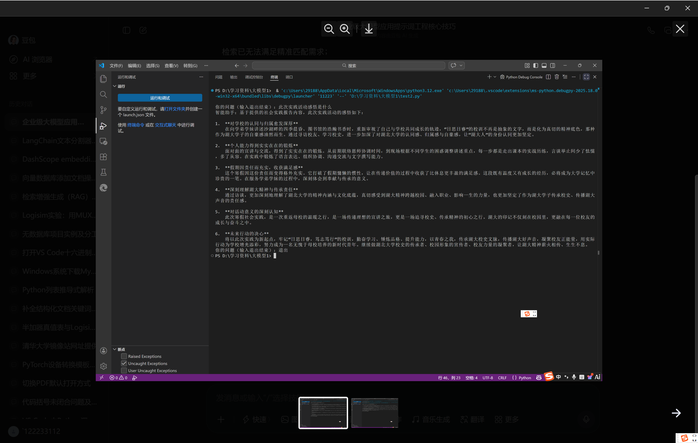
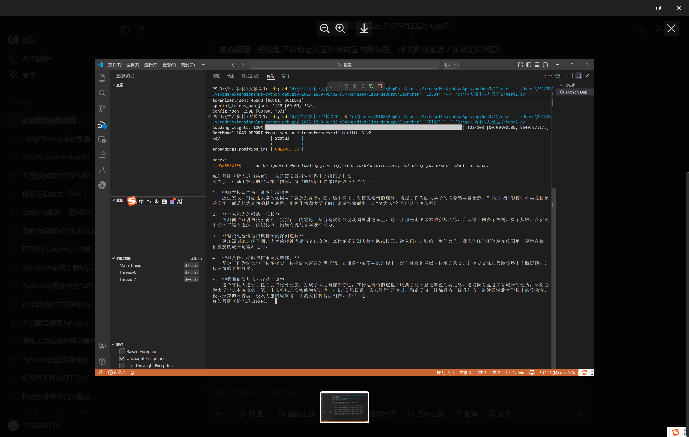

# RAG技术介绍

## 本质
- RAG技术就是大模型的“开卷考试”，大模型在对提供的资料进行检索之后生成给予资料给出的回答，能够有效解决普通在线大模型幻觉，时效性以及容易造成企业私有数据泄露的问题

## 实现
- RAG本质上就三步，提问->检索->生成，其他的文本切分，向量化等等都是后期基于文档的变化给出的相应优化措施

1. 最简实现
```python
#最简RAg实现
import os
api_key = os.getenv("DASHSCOPE_API_KEY")
if not api_key:
    raise ValueError("未找到环境变量 DASHSCOPE_API_KEY，请先配置")


client = OpenAI(
    api_key=api_key,
    base_url="https://dashscope.aliyuncs.com/compatible-mode/v1",

)

file_paths = [
    r"D:\学习资料\大模型1\knowledge.txt",
]

# 1. RAG：读资料

with open(r"D:\学习资料\大模型1\knowledge.txt", "r", encoding="utf-8") as f:
    doc_content = f.read().strip()


# 2. Agent：拆步骤+用资料回答

while True:
        user_question = input("\n你的问题（输入退出结束）：")
        if user_question == "退出":
            break
        else:
            completion = client.chat.completions.create(
            model="qwen3.5-plus",
            messages=[
                {"role": "system", "content": f"基于以下文档拆解步骤回答问题：{doc_content}"},
                {"role": "user", "content": user_question}
                ],
            stream=True
    )

            print("智能助手：", end="")
            for chunk in completion:
                delta = chunk.choices[0].delta
                if delta and delta.content:
                    print(delta.content, end="", flush=True)
```
- 对应的文档是就只有几十字的txt，适合用最原始的方案

```txt
1. 列表添加元素：用append()方法，示例：lst = [1,2]; lst.append(3) → [1,2,3]
2. 字典取值：用key，示例：dic = {"name":"张三"}; dic["name"] → "张三"
3. 循环打印：for i in range(5): print(i) → 打印0-4
```
- 这种情况下大模型会直接把整个文档全部扫一遍再给出答案，所以只适合字数很少的简单文档，文档一长效率就会很低，因此长文档就需要切分

2. 文档切分
- 将长文本按段落，语义切成小段，方便后续的检索步骤
- 本项目采取的切分方式就是按照关键词切分，然后再过滤掉长度<20的字段，如果为空那就全文返回
```python
    module_anchors = ["实践体会", "校友寻访", "前期筹备"]
    for anchor in module_anchors:
        if anchor in text:
            text = text.replace(anchor, f"\n\n{anchor}")
    chunks = [c.strip() for c in text.split("\n\n") if c.strip() and len(c) > 20]
    if not chunks:
        return text
```
- 这种切割方式的局限性就是高度依赖关键词以及切分粒度不均（比如“前期筹备”下面可能有很长一段话会被全部切进来），可用增强关键词容错（增加语义相近文本）以及长文本细分的方式进行优化

- 这个阶段使用了关键词检索的方式，让模型跑遍整个文本寻找关键词并返回语段，实测之后发现返回了大量与提问内容无关的语段，这是因为现在还没有对语义是否相似进行比较讨论，只是单纯返回了带关键词的字段


3. 文本向量化
- 对文本进行切分后，将文本通过一个向量模型转成向量存入向量数据库，同时也将问题转成向量，利用余弦相似度算法算语义是否相近，选出语义最相近的几段文本拼起来
- 单独处理了语义是否相似的问题，避免了回答无关信息，同时对模糊提问回答更精准

- 无数据库版本
```python
    # 2. 文本/问题转向量（存在内存）
    chunk_vectors = model.encode(chunks)  # 数组形式存在内存
    question_vector = model.encode([question])[0]
    
    # 3. 纯内存计算余弦相似度（核心：不用向量库，手动算）
    # 归一化向量（保证相似度计算准确）
    chunk_vectors = chunk_vectors / np.linalg.norm(chunk_vectors, axis=1, keepdims=True)
    question_vector = question_vector / np.linalg.norm(question_vector)
    # 计算每个段落向量与问题向量的相似度（值越大越相似）
    similarities = np.dot(chunk_vectors, question_vector)
    
    # 4. 取相似度最高的top_k个段落
    top_indices = similarities.argsort()[-top_k:][::-1]  # 按相似度降序排序
    relevant_chunks = [chunks[i] for i in top_indices if i < len(chunks)]
    
    return "\n\n".join(relevant_chunks)
```

- 有数据库版本（用的是Chromadb）
```python
client = chromadb.PersistentClient(path="./chroma_practice_db")
collection = client.get_or_create_collection(name="practice_report")

def init_chroma_db(text):
    """初始化向量库：只运行1次，把文本转向量存入Chroma"""
    # 切分文本（复用你现有的逻辑）
    module_anchors = ["实践体会", "校友寻访", "前期筹备"]
    for anchor in module_anchors:
        if anchor in text:
            text = text.replace(anchor, f"\n\n{anchor}")
    chunks = [c.strip() for c in text.split("\n\n") if c.strip() and len(c) > 20]
    if not chunks:
        return text
    # 转向量
    vectors = model.encode(chunks).tolist()

    # 存入向量库（ID自定义）
    ids = [f"chunk_{i}" for i in range(len(chunks))]
    collection.add(embeddings=vectors, documents=chunks, ids=ids)

def search(question, top_k=3):
    """检索：直接从Chroma查，无需重复转向量"""
    q_vector = model.encode([question]).tolist()
    results = collection.query(query_embeddings=q_vector, n_results=top_k)
    return "\n\n".join(results["documents"][0])
```
- 向量数据库能够将向量化后的文档长期保存，同时提供了一些高效筛选的方法，便于模型检索
- 向量检索就能够避免掉一些和提问无关的语段，提高精准度



## 总体流程
- 经过上述的探索，RAG的基本流程从一开始的简单流程扩展到了能够更加全面标准化的流程，总体分为索引，检索和生成三个阶段

1. 索引阶段
- 相当于数据准备，对初始文档进行切分，用向量模型向量化，再存入向量数据库，这个过程是离线的

2. 检索阶段
- 用户进行提问，对问题向量化，向量模型从数据库利用余弦相似度找出语义最相近的top_k个片段，这个阶段是在线的

3. 生成阶段
- 把这top_k个片段拼成一段提示词喂给大模型再让大模型给出回答，这个阶段也是在线的

- 注意，检索阶段查库用的模型必须要和索引阶段向量化用的模型一样，不然会查错字（因为每个向量模型在训练阶段得到关于同一个字的向量都不一样）


## langchain扩展
- 在熟悉上述流程之后，我们用langchain框架将每个阶段的实现封装成模块再拼接到一起，langchain框架不仅能够封装，还对接口进行统一，这样后续如果换模型SDK，换数据库，换方法都会比较容易

1. 文本切割部分
- 运用了CharacterTextsplitter方法进行切分
```python
    text_splitter = CharacterTextSplitter(chunk_size=500, chunk_overlap=50)
    texts = text_splitter.split_text(text_content)
```
- 这个方法类似于之前手写的切分方法，是按空格，逗号等分隔符进行分割再继续分割长文本，这样容易导致语义被截断，因此可切换为Recursivetextsplitter方法
- Recursivetextsplitter方法是按照语义单元（如词，句子，段落）先切一遍，切了之后如果文本超长了再按照语义单元一直切，万不得已才会强行截断，最大程度保留了语义完整度


2. 向量化部分
- 本项目用documents方法将切分后的文本转成langchain的documents格式，再用add_document方法向量化了存入数据库，最后调用similarity_search方法进行检索

```python
#将切分之后的文档用document方法包装成langchain标准格式
documents = [Document(page_content=t) for t in texts]

#初始化数据库，并且检索的时候会通过这个代码链接数据库
   vector_store = Chroma(
    persist_directory=DB_PATH,  # 向量数据存在本地的路径（持久化，重启不丢）
    embedding_function=embeddings,  # 绑定向量化模型（检索时要用来转query为向量）
    collection_name=COLLECTION_NAME  # 向量集合名（区分不同数据集）
)

 #用add-documents方法将文本转向量放到数据库里面（第一次这样，以后就不用了）
    if vector_store._collection.count() == 0:
        print("💾 数据库为空，正在构建索引...")
        vector_store.add_documents(documents)
        print(f"✅ 索引构建完成，共存入 {len(documents)} 个片段。")
    else:
        count = vector_store._collection.count()
        print(f"✅ 数据库已加载，现有 {count} 个片段 (跳过重复写入)。")

#检索阶段将问题向量化，连接数据库之后用余弦相似度找最近k个片段
  docs = vector_store.similarity_search(query, k=k)
```

- 检索部分可以用similarity_search_with_score方法，可以得到一个相似度分数（有多相似），再通过过滤掉相似度低的内容可以实现更加精准的检索

```python
 docs_with_score = vector_store.similarity_search_with_score(query, k=k)
 #过滤低相关内容
 valid_docs = [doc for doc, score in docs_with_score if score >= 0.7]
```


